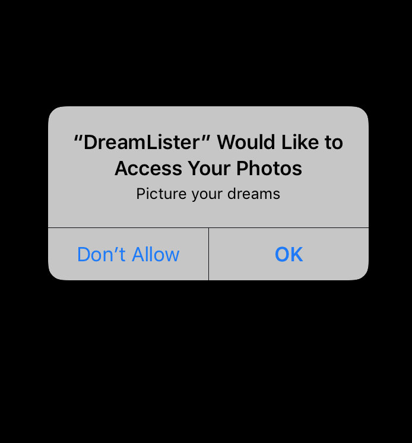

# DreamLister  
This app was made following along Devslopes course on Udemy.  
Sortof like a wishlist, add picture, price, description and save it to home screen.  
Once multiple items are saved, iOS Core Data can be used to sort it by newest added, Price, or name  

  

  

  

  

